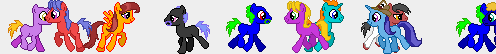

# PonyStream

A small library to free lots of ponies at the bottom of any element of your web page.
[Demo here](https://rawgit.com/fpirsch/ponystream/master/ponystream.html).



```
// Starts in the <body> as soon as all images are loaded.
PonyStream.load().then(PonyStream.start);

// Load first, start later at the bottom of any DOM node.
PonyStream.load();
...                              // wait for some event
PonyStream.start(container);

// Load your own set of images instead of the classical ponies.
PonyStream.load([
    'image1.gif',
    'image2.gif',
    'image3.gif',
    'image4.gif'
]);
```

Limitation: ponies will only trot in one DOM container. Not responsive.
